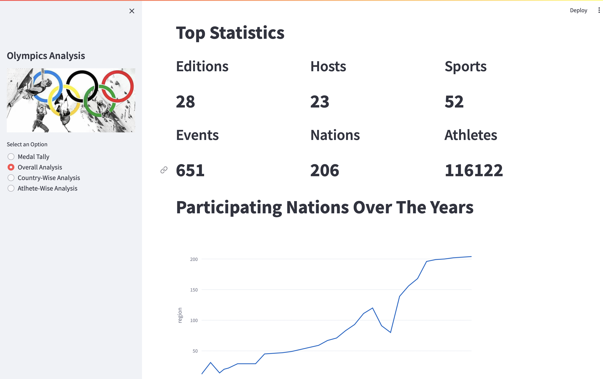
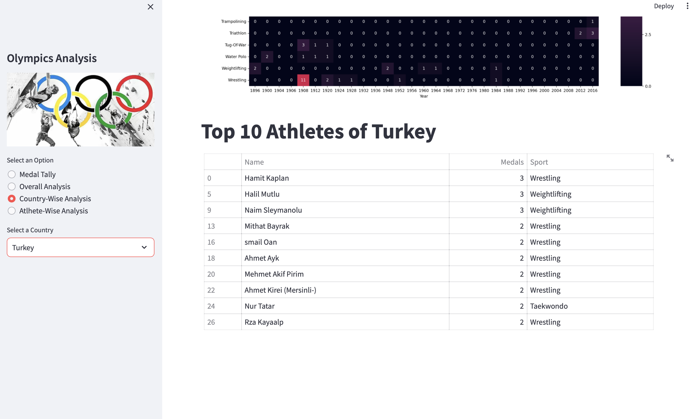
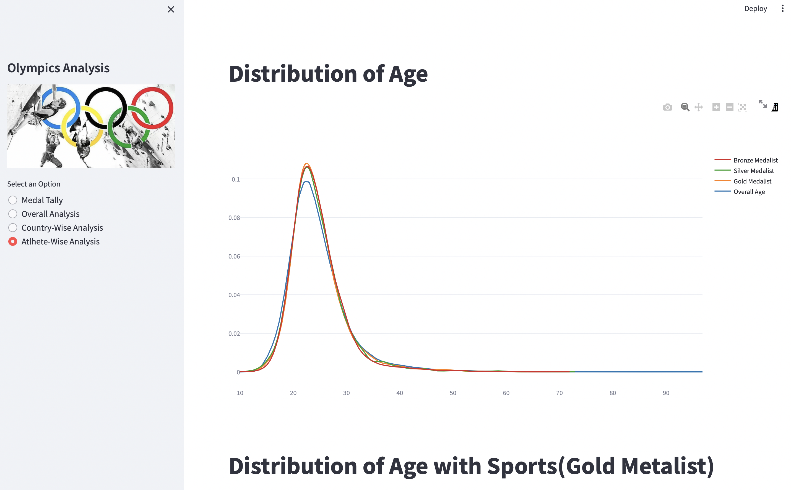

# Olympic_Analysis_App-
Data Analysis Project | Streamlit | Pandas | Matplotlib | seaborn 
# Olympic Data Analysis Project with streamlit app 





## Proje Açıklaması

Bu proje, Olimpiyat Oyunları verileri üzerinden veri analizi ve görselleştirme işlemleri gerçekleştirmek için Python programlama dili ve çeşitli veri bilimi kütüphaneleri kullanılarak geliştirilmiş bir Data Analizi projesidir.

Veri kaynağı : https://www.kaggle.com/datasets/heesoo37/120-years-of-olympic-history-athletes-and-results

Proje, aşağıdaki ana hedefleri gerçekleştirmeyi amaçlamaktadır:

1. **Madalya Tablosu (Medal Tally)**: Olimpiyat Oyunları madalya tablosunu yıl ve ülke bazında görüntüleme ve sorgulama.
2. **Genel Analiz**: Olimpiyat Oyunları hakkında genel istatistiklerin sunulması.
3. **Ülke Bazlı Analiz**: Belirli bir ülkenin Olimpiyat geçmişinin analiz edilmesi.
4. **Sporcu Bazlı Analiz**: Olimpiyat sporcularının dağılımı ve başarılarının incelenmesi.

Proje, veri analizi ve görselleştirmenin yanı sıra, Streamlit ve Plotly gibi araçlar kullanarak sonuçları Streamlit sayesinde web tabanlı bir arayüz üzerinde görüntülemenizi sağlar.





## Nasıl Kullanılır

Projeyi kullanmak için aşağıdaki adımları takip edebilirsiniz:

1. Proje kaynak kodlarını bu deposu klonlayarak yerel bir bilgisayarınıza indirin veya GitHub'dan ZIP dosyası olarak indirin.

2. Projeyi çalıştırmadan önce aşağıdaki bağımlılıkları kurduğunuzdan emin olun:

   ```bash
   pip install -r requirements.txt
